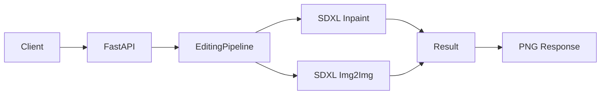
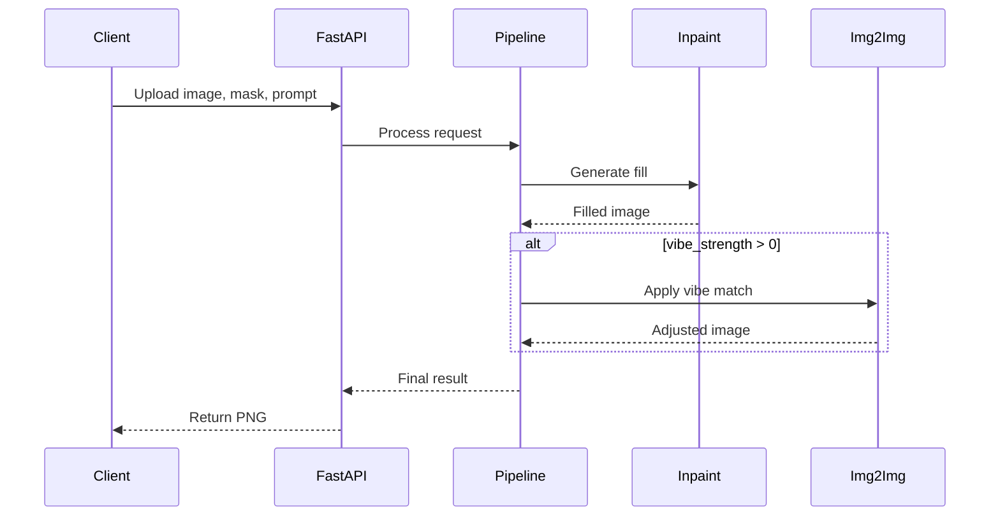

# Image Editing with Stable Diffusion XL Featuring Generative Fill and Edge Harmonization

---

## Overview

**Features:**
- Text-guided Generative Fill
- Edge-aware Harmonization
- Two-pass Smart Fill with lighting/style matching
- Low VRAM optimized

**Tech Stack:**
- Stable Diffusion XL
- FastAPI REST API

## Architecture

**Core Files:**
- `server.py` - API server
- `editing_pipelines_fill.py` - Image editing pipeline
- `quantization_utils.py` - Model optimization
- `pruning_utils.py` - Performance optimization
- `requirements.txt` - Dependencies




---

## Parameters

- `prompt` - Desired content description
- `mask` - White for edit region, black for preserve
- `vibe_strength` - Style matching intensity (0.0-1.0)

**Recommended Values:**

| Task | Steps | Vibe Strength |
|------|-------|---------------|
| Replace background | 30 | 0.3 |
| Add object | 30 | 0.2 |
| Fast relight | 20 | 0.1 |
| Harmonize edges | 15 | 0 |

---

## Performance

- **VRAM:** 8-9 GB
- **Speed:** First run downloads models, subsequent runs are faster
- **Optimization:** Adjust steps and vibe_strength parameters for quality/speed tradeoff

---

## Installation

```powershell
python -m venv .venv
.\.venv\Scripts\Activate.ps1
pip install torch torchvision --index-url https://download.pytorch.org/whl/cu121
pip install -r requirements.txt
```

## Usage

```powershell
python server.py
```

Server: `http://localhost:8080`  
API Docs: `http://localhost:8080/docs`

**Requirements:** GPU recommended, models auto-download on first run.

---

## Workflow

**Smart Fill:**
1. Upload image, mask, and prompt
2. Generate content in masked area
3. Apply optional style matching
4. Return processed image

**Harmonization:**
1. Detect object boundaries
2. Blend edges seamlessly



---

## API Endpoints

**`GET /health`**  
Health check

**`POST /generative-fill`**  
Params: `image`, `mask`, `prompt`  
Returns: PNG image

**`POST /smart-fill`**  
Params: `image`, `mask`, `prompt`, `vibe_strength`  
Returns: PNG image

**`POST /harmonize`**  
Params: `image`, `mask`  
Returns: PNG image

### Examples

```powershell
curl -Method GET http://localhost:8080/health

curl -Method POST "http://localhost:8080/smart-fill" \
	-Form image=@"C:\img\image.png" \
	-Form mask=@"C:\img\mask.png" \
	-Form prompt="a cozy wooden table background" \
	-Form vibe_strength=0.3 --output out.png

curl -Method POST "http://localhost:8080/harmonize" \
	-Form image=@"C:\img\composite.png" \
	-Form mask=@"C:\img\sticker_mask.png" --output out_h.png
```

---

## Performance Charts

### GPU Utilization


### System Metrics


### Detailed Metrics


### Additional Analysis


